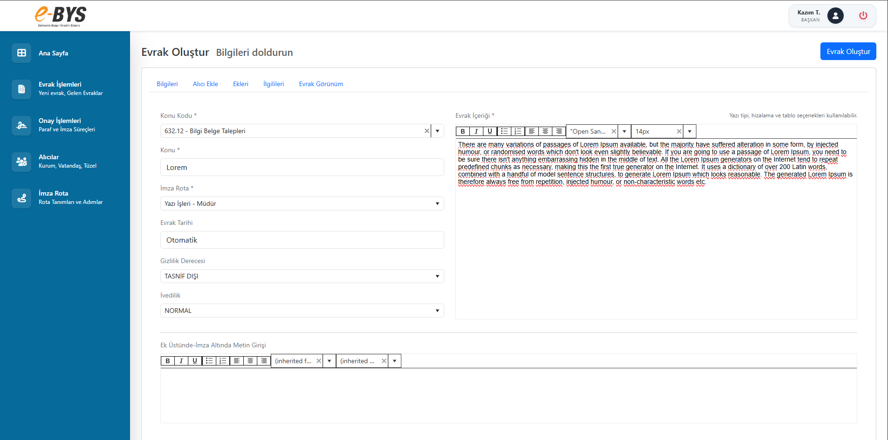
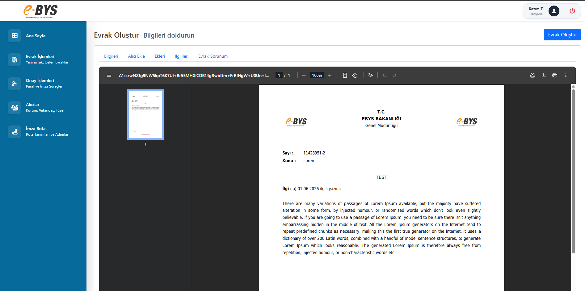
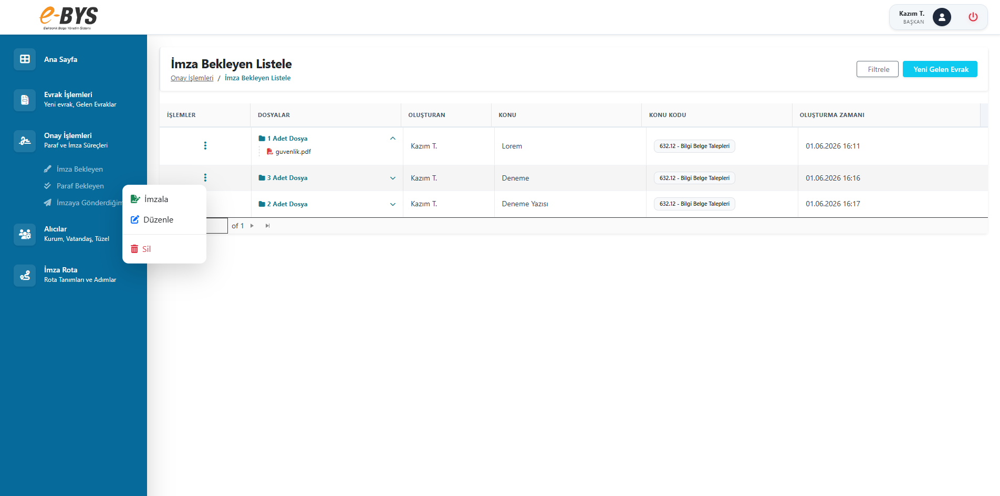
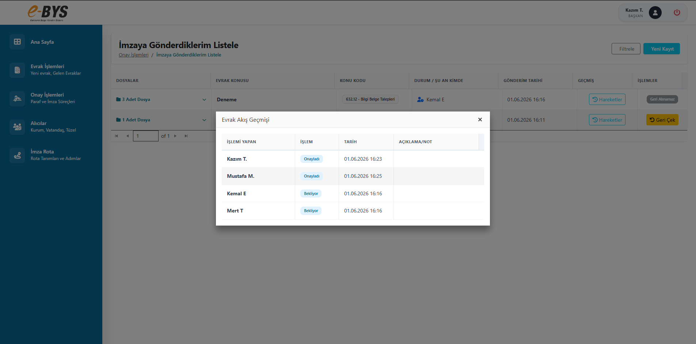
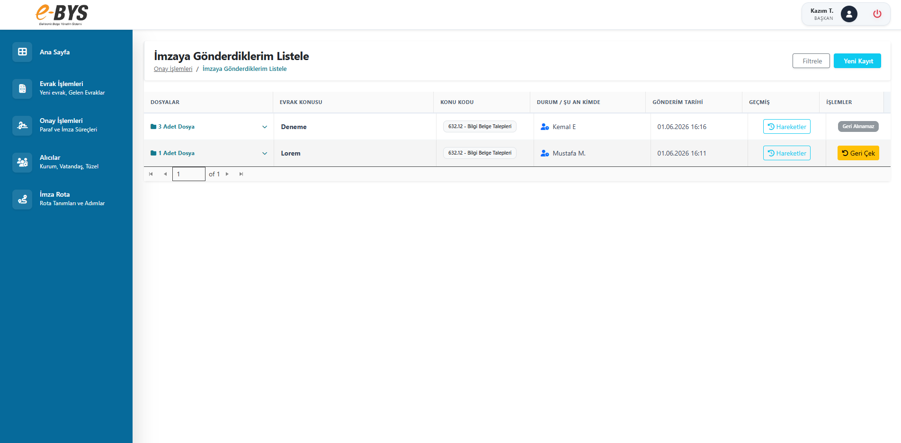
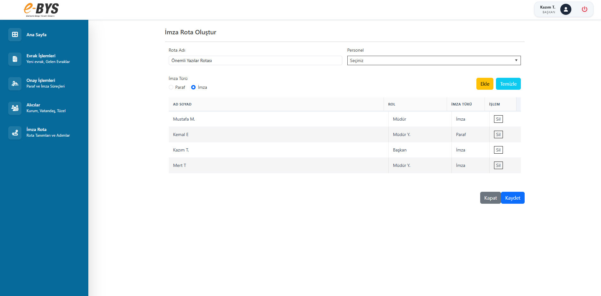
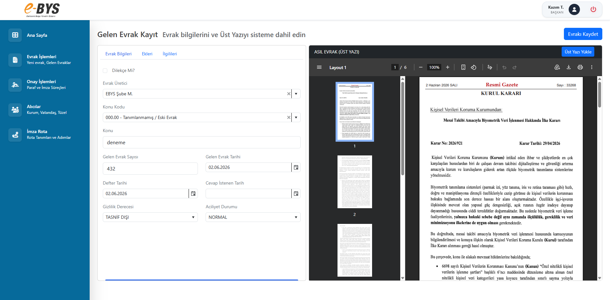
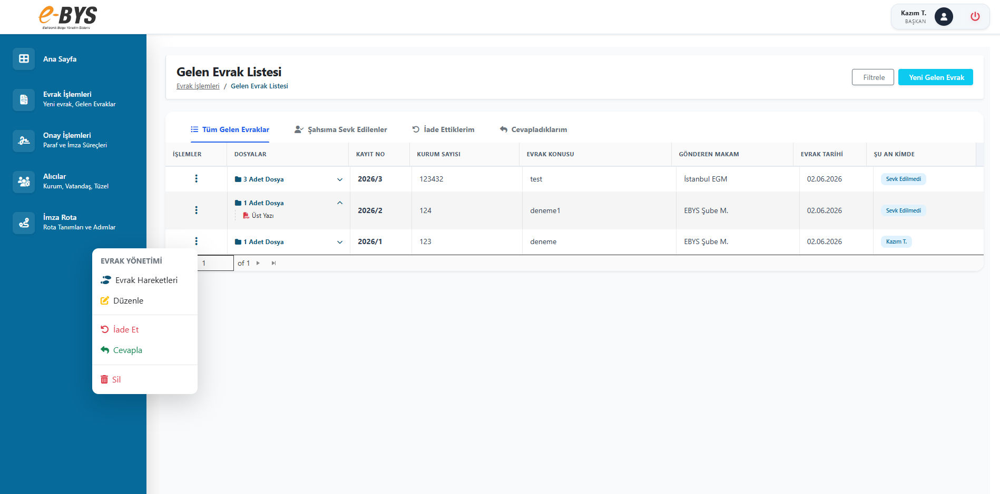
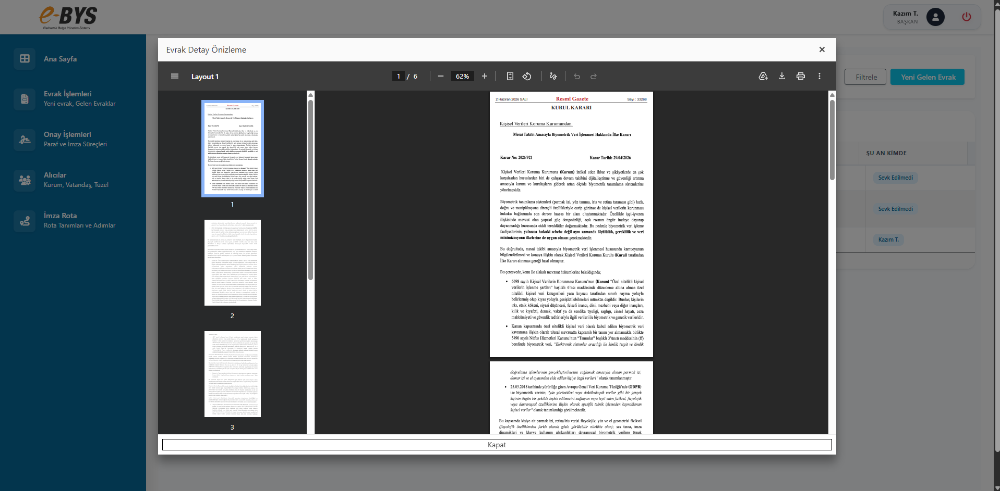
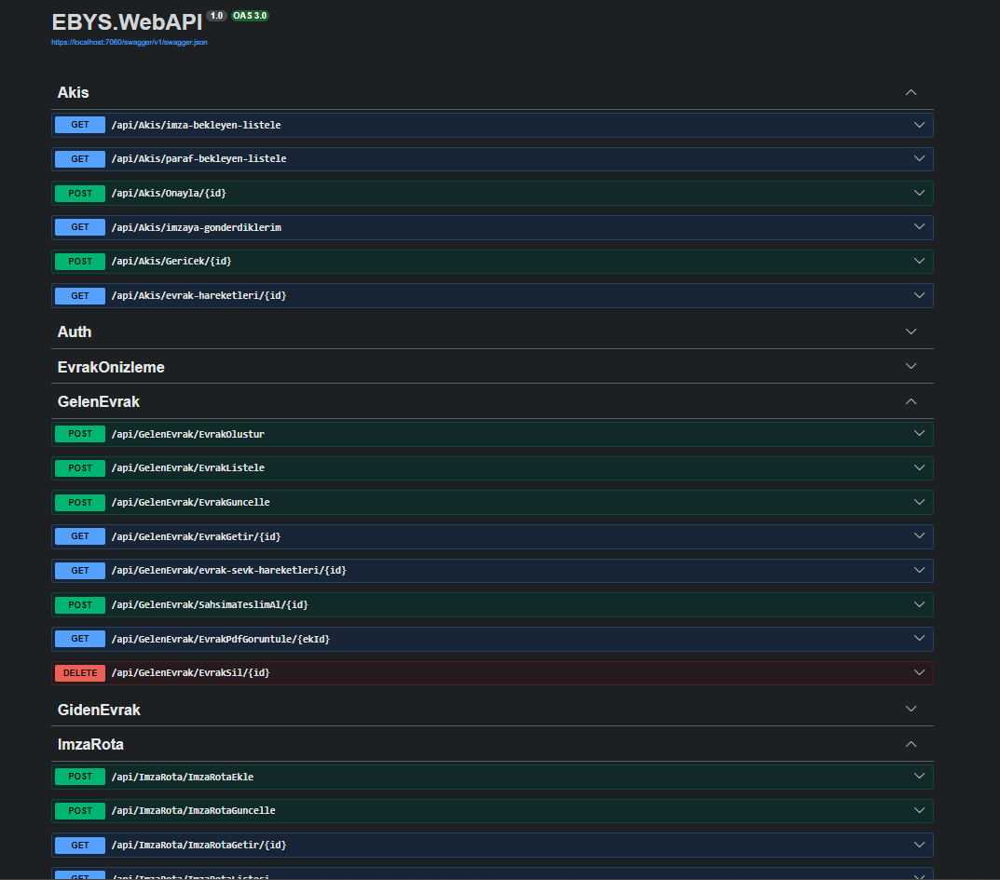

# EBYS (Elektronik Belge Yönetim Sistemi)

Bu proje; kurumsal organizasyonlardaki evrak süreçlerini dijitalleştirmek, hiyerarşik imza akışlarını yönetmek ve belgeleri güvenli bir şekilde arşivlemek amacıyla geliştirilmiş modern bir **Elektronik Belge Yönetim Sistemi (EBYS)** uygulamasıdır.

---

## 🚀 Öne Çıkan Özellikler

* **Evrak Yönetimi:** Gelen ve Giden evrakların sisteme kaydedilmesi, sınıflandırılması ve takibi.
* **Hiyerarşik Düzen:** Kurum içi hiyerarşiye uygun kullanıcı ve rol yönetimi.
* **Sıralı ve Güvenli İmza Akışı:** İmza sürecine dahil edilen kişilerin, hiyerarşik sıraya göre (asenkron/senkron) evrakı görüntülemesi ve güvenli bir şekilde imzalayabilmesi.
* **Asenkron PDF Dönüştürme:** Formlara girilen dinamik verilerin, arka planda asenkron bir şekilde resmi PDF şablonlarına dönüştürülmesi.

---

## 🛠️ Kullanılan Teknolojiler ve Rolleri

Projede sürdürülebilirlik, performans ve güvenlik odaklı modern bir teknoloji yığını tercih edilmiştir:

### Backend & Mimari
* **ASP.NET Core 9.0:** Yüksek performanslı, cross-platform ve ölçeklenebilir backend servisleri için kullanıldı.
* **Clean Architecture:** Projenin iş mantığını (Domain/Application) dış dünyadan (Infrastructure/UI) soyutlayarak; test edilebilir, bakımı kolay ve gevşek bağlı (loosely coupled) bir yapı kuruldu.
* **DTO & AutoMapper:** Veritabanı modelleri ile arayüze sunulan verileri (DTO) birbirinden ayırmak ve bu nesneler arasındaki eşlemeyi (mapping) otomatik ve performanslı hale getirmek için tercih edildi.

### Veritabanı
* **PostgreSQL:** Evrak verilerinin, kullanıcı hiyerarşisinin ve imza akış süreçlerinin güvenli, performanslı ve ilişkisel bir şekilde saklanması için güçlü bir açık kaynaklı ilişkisel veritabanı (RDBMS) olarak seçildi.

### Frontend & Arayüz
* **AJAX & jQuery:** Asenkron veri gönderimi/alımı sağlayarak, kullanıcı deneyimini akıcı hale getirmek için kullanıldı.
* **Telerik UI:** Gelişmiş veri tabloları, dinamik form elemanları ve kurumsal raporlama arayüzleri için zengin UI bileşen kütüphanesinden yararlanıldı.

---

## 🏗️ Mimari Yapı (Clean Architecture)

Proje, bağımlılıkların içeriye doğru aktığı 4 ana katmandan oluşmaktadır:

1. **Domain:** Entity'ler, value object'ler ve çekirdek kurallar.
2. **Application:** DTO'lar, AutoMapper profilleri ve iş mantığı (Business Logic).
3. **Infrastructure:** Veritabanı bağlantıları (PostgreSQL), JWT servisleri ve dış entegrasyonlar.
4. **WebUI / Presentation:** Kullanıcının etkileşime girdiği ASP.NET Core MVC / API katmanı (Telerik & Ajax entegreli).


## 🔧 Kurulum ve Çalıştırma

Projeyi yerel bilgisayarınızda çalıştırmak için aşağıdaki adımları takip edebilirsiniz:

1. **Projeyi Klonlayın:**
   ```bash
   git clone [https://github.com/thisiskazim/EBYS.git](https://github.com/thisiskazim/EBYS.git)

2. **Bağımlılıkları Yükleyin:**
   ```bash
   cd EBYS
   dotnet restore
   ```

3. **Veritabanı Bağlantısını Yapılandırın:**
   WebAPI projesinin `appsettings.json` dosyasını açın ve PostgreSQL bağlantı dizesini güncelleyin:
   ```json
   "ConnectionStrings": {
     "DefaultConnection": "Host=localhost;Port=5432;Database=EbysDb;Username=postgres;Password=your_password"
   }
   ```

4. **Veritabanını Oluşturun ve Migrasyonları Uygulayın:**
   ```bash
   dotnet ef database update
   ```

## 🖼️ Görünümler
   1. **Giden Evrak İçin Bazı Görünümler:**
    
    
    
    
    
    
 
   2. **Gelen Evrak İçin Bazı Görünümler:**
    
    

   3. **Diğer Bazı Görünümler:**
    
    


