# EBYS — Elektronik Belge Yönetim Sistemi

Kurumsal giden/gelen evrak, hiyerarşik imza akışı, muhatap yönetimi ve belge arşivleme.

[](https://dotnet.microsoft.com/)
[](https://www.postgresql.org/)
[](https://www.docker.com/)

---

## Mimari

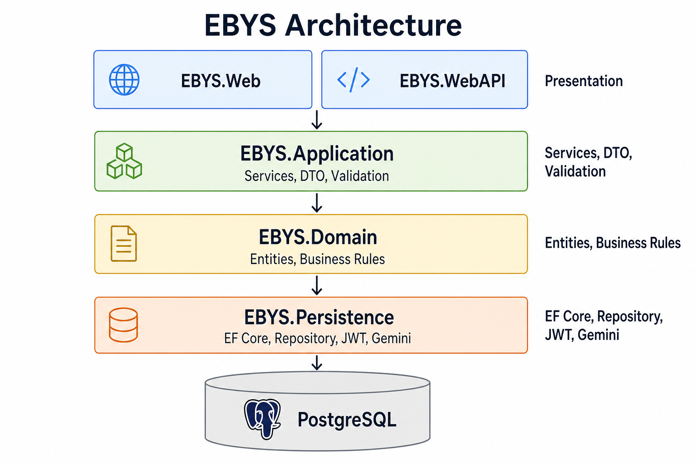

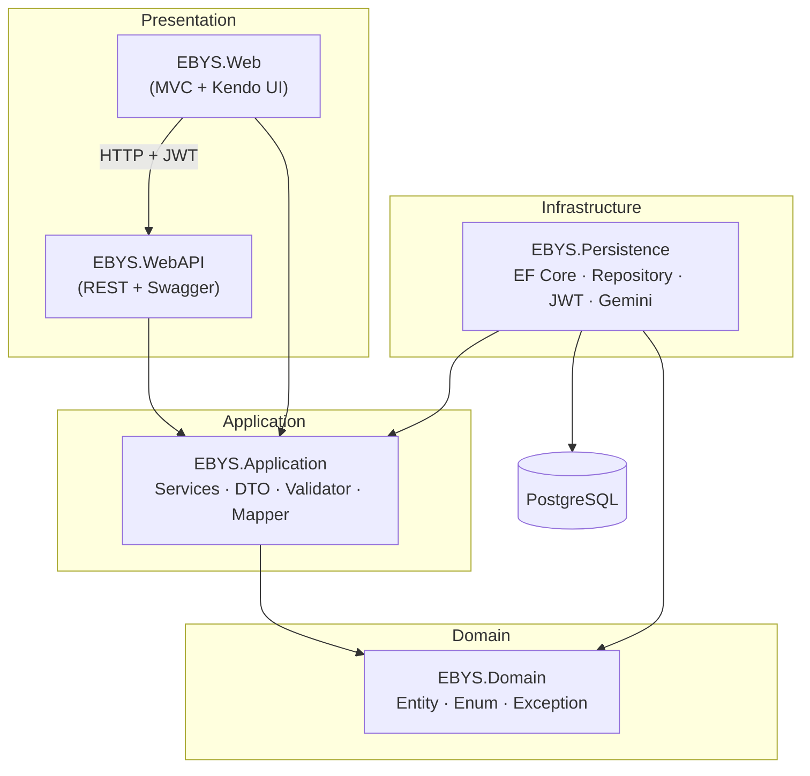
```mermaid
graph TB
    subgraph Presentation
        WEB["EBYS.Web<br/>(MVC + Kendo UI)"]
        API["EBYS.WebAPI<br/>(REST + Swagger)"]
    end

    subgraph Application
        APP["EBYS.Application<br/>Services · DTO · Validator · Mapper"]
    end

    subgraph Domain
        DOM["EBYS.Domain<br/>Entity · Enum · Exception"]
    end

    subgraph Infrastructure
        PER["EBYS.Persistence<br/>EF Core · Repository · JWT · Gemini"]
    end

    DB[("PostgreSQL")]

    WEB -->|HTTP + JWT| API
    API --> APP
    WEB --> APP
    APP --> DOM
    PER --> APP
    PER --> DOM
    PER --> DB
```

---

## İstek Akışı

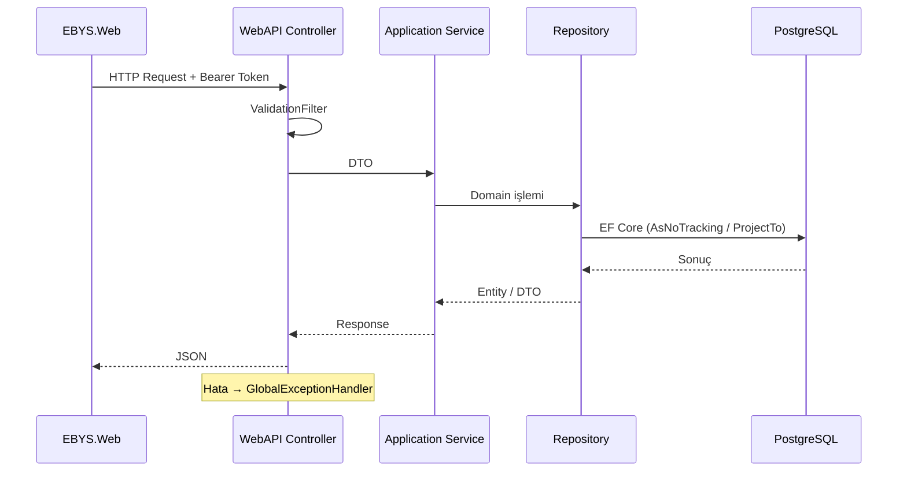
```mermaid
sequenceDiagram
    participant UI as EBYS.Web
    participant API as WebAPI Controller
    participant SVC as Application Service
    participant REPO as Repository
    participant DB as PostgreSQL

    UI->>API: HTTP Request + Bearer Token
    API->>API: ValidationFilter
    API->>SVC: DTO
    SVC->>REPO: Domain işlemi
    REPO->>DB: EF Core (AsNoTracking / ProjectTo)
    DB-->>REPO: Sonuç
    REPO-->>SVC: Entity / DTO
    SVC-->>API: Response
    API-->>UI: JSON

    Note over API: Hata → GlobalExceptionHandler
```

---

## İmza Akışı

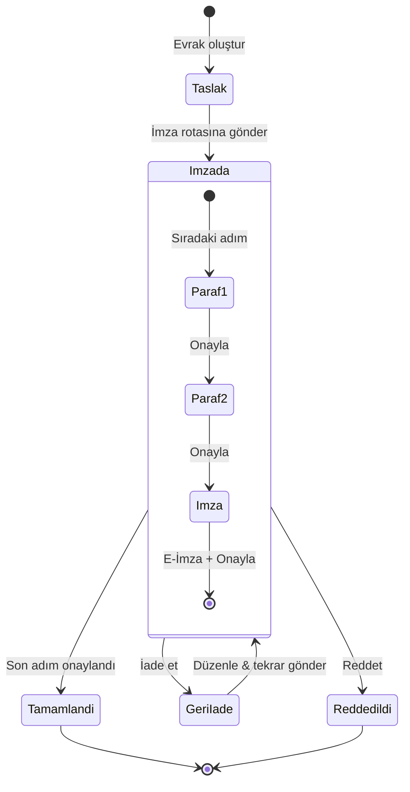
```mermaid
stateDiagram-v2
    [*] --> Taslak: Evrak oluştur
    Taslak --> Imzada: İmza rotasına gönder

    state Imzada {
        [*] --> Paraf1: Sıradaki adım
        Paraf1 --> Paraf2: Onayla
        Paraf2 --> Imza: Onayla
        Imza --> [*]: E-İmza + Onayla
    }

    Imzada --> Tamamlandi: Son adım onaylandı
    Imzada --> GeriIade: İade et
    Imzada --> Reddedildi: Reddet
    GeriIade --> Imzada: Düzenle & tekrar gönder
    Tamamlandi --> [*]
    Reddedildi --> [*]
```

---

## Modüller

| Modül | İşlev |
|---|---|
| Giden Evrak | Oluşturma, alıcı/ek/ilgi, konu kodu, AI taslak |
| Gelen Evrak | Kayıt, sevk, teslim alma |
| İmza Akışı | Paraf/imza sırası, onay, red, iade, geri çek |
| İmza Rotası | Tekrar kullanılabilir imza şablonları |
| Muhatap | Kurum / tüzel kişi / bireysel |
| Evrak Önizleme | PDF görüntüleme |

---

## Teknolojiler

| | |
|---|---|
| Backend | ASP.NET Core 9, Clean Architecture |
| Veritabanı | PostgreSQL, EF Core |
| Auth | JWT Bearer, multi-tenant filtre |
| Mapping | AutoMapper (`ProjectTo`) |
| Validasyon | FluentValidation |
| Loglama | Serilog |
| AI | Google Gemini API |
| Frontend | MVC, jQuery, Telerik Kendo UI, Bootstrap 5 |

---

## Kurulum

**Gereksinim:** [Docker Desktop](https://www.docker.com/products/docker-desktop/)

```bash
git clone https://github.com/thisiskazim/EBYS.git
cd EBYS
docker compose up --build
```

| Servis | Adres |
|---|---|
| Web UI | http://localhost:5001 |
| API | http://localhost:5000 |
| PostgreSQL | localhost:5433 |

Veritabanı `init.sql` ile container ilk ayağa kalktığında otomatik oluşturulur. Kullanıcının .NET SDK veya PostgreSQL kurmasına gerek yoktur.

**Telerik build:** İlk build sırasında NuGet kimlik bilgisi gerekir. `docker-compose.yml` içindeki `TELERIK_USERNAME` / `TELERIK_PASSWORD` değerlerini kendi hesabınızla güncelleyin.

**Gemini AI (opsiyonel):** `ebys-api` servisine `GeminiSettings__ApiKey` environment değişkeni ekleyin.

---

## Ekran Görüntüleri

**Giden Evrak**

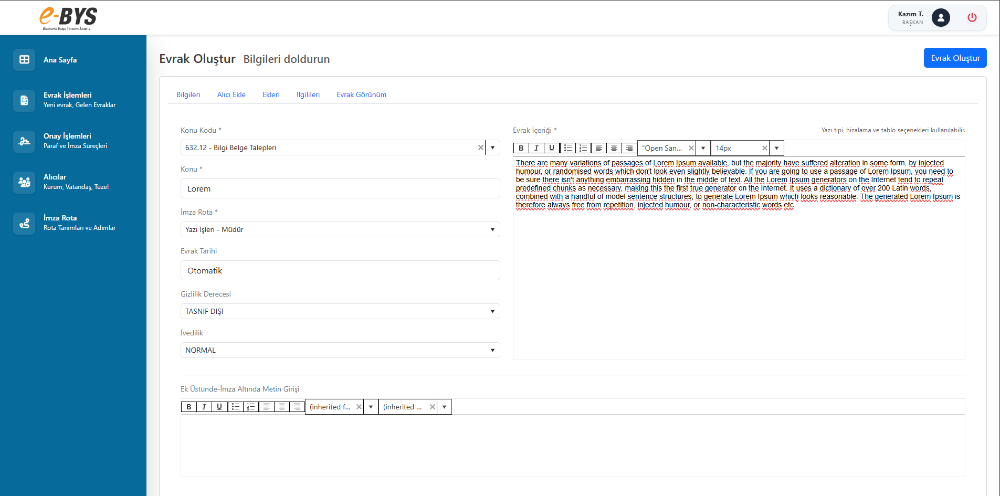
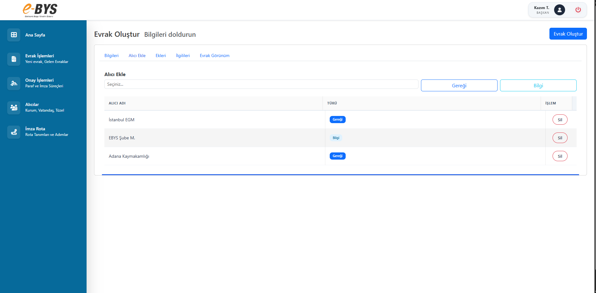
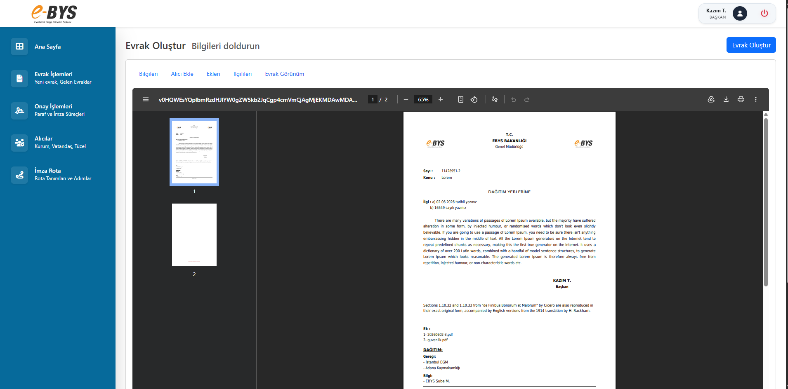
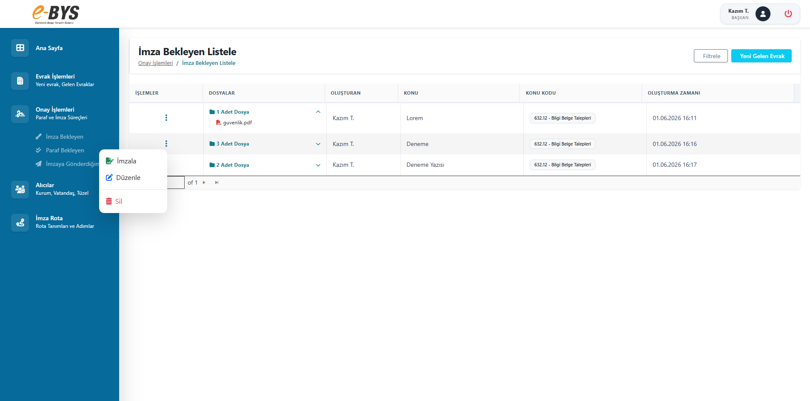
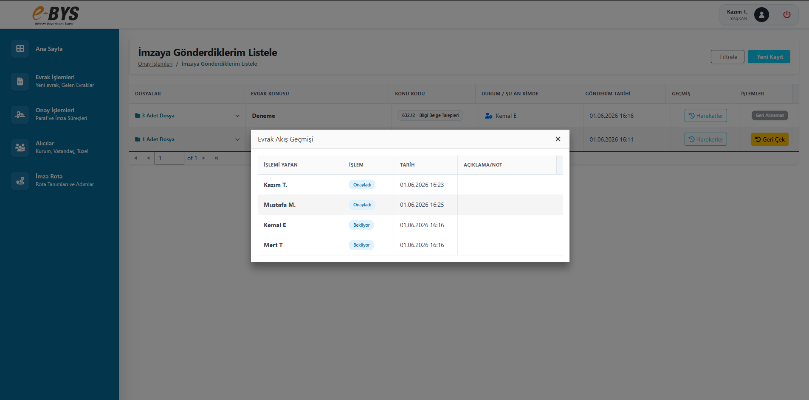
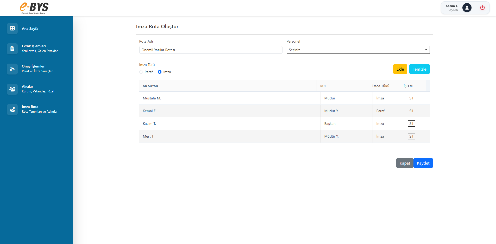

**Gelen Evrak**

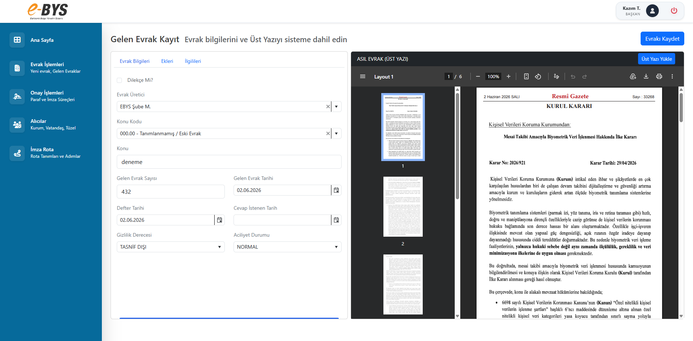
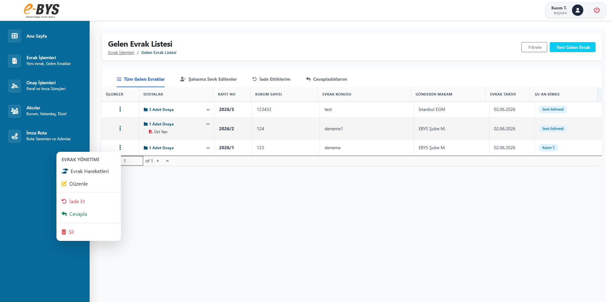

**Diğer**

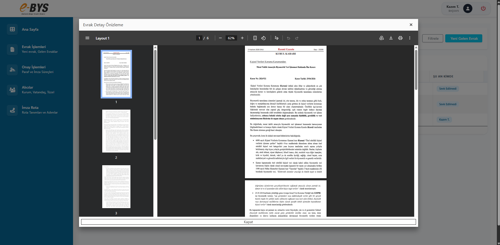
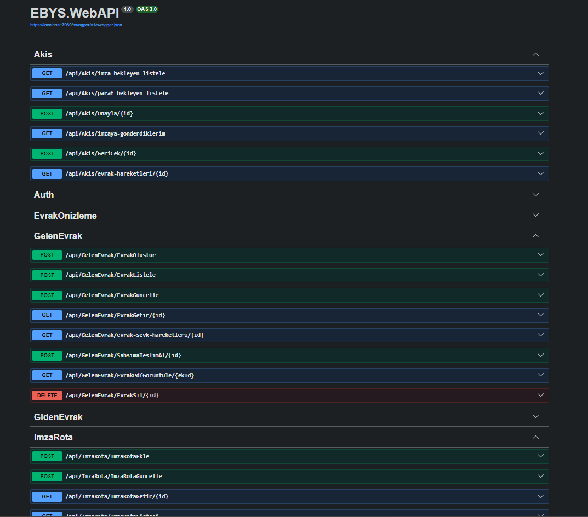

---

## Proje Yapısı

```
EBYS/
├── EBYS.Domain/
├── EBYS.Application/
├── EBYS.Persistence/
├── EBYS.WebAPI/
└── EBYS.Web/
```
